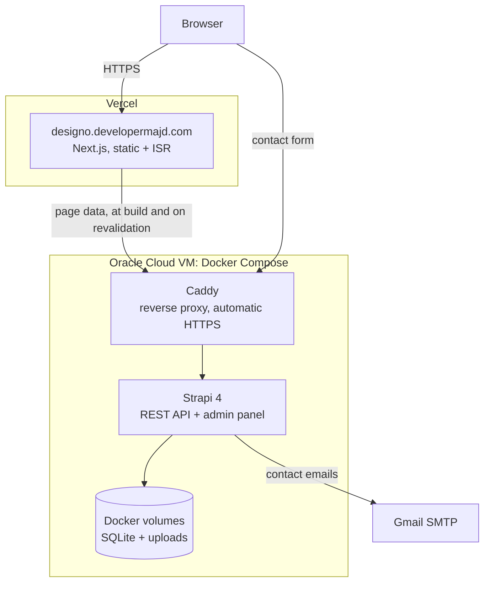

<div align="center">

# Designo — CMS-driven agency website

A multi-page agency website where every page, menu and label is edited in a
headless CMS instead of being hard-coded. Built from a
[Frontend Mentor](https://www.frontendmentor.io/challenges/designo-multipage-website-G48K6rfUT)
design into a full-stack project: a Next.js frontend on Vercel and a Strapi backend
that I deploy and run myself.

**[designo.developermajd.com](https://designo.developermajd.com)** ·
[Frontend repo](https://github.com/DeveloperMajd/designo-frontend) ·
[Backend repo](https://github.com/DeveloperMajd/designo-backend)

</div>


## What this is

Seven pages (home, web design, app design, graphic design, about, locations, contact)
built from a small set of reusable sections. The pages are not hard-coded: each one is
a *Page* entry in Strapi with a dynamic zone of sections, and the frontend renders
whatever the editor puts there. Adding a page or reordering sections is a CMS edit,
not a code change or a redeploy.

## Feature highlights

- **Editor-driven pages**: 10 section types (banners, project grids, info highlights,
  locations, contact form, ...) composed per page in Strapi's dynamic zones
- **Static with incremental regeneration**: pages are prerendered and refreshed in the
  background every two minutes, so content edits go live without a rebuild
- **Editable navigation and copy**: menus (`strapi-plugin-menus`), labels and contact
  details all come from the CMS
- **Locations page with real maps**: Leaflet / OpenStreetMap, loaded client-side only
- **Contact form** with client-side validation and a hardened endpoint: server-side
  validation, HTML-escaped emails, `Reply-To` instead of a spoofed sender, and per-IP
  plus daily rate limits
- **Motion**: scroll-triggered animations with Framer Motion
- **Responsive** mobile / tablet / desktop layout with Bulma and SCSS

## Architecture



The frontend fetches page data from the API on the server, at build time and whenever
a page is revalidated, so visitors normally get prerendered HTML. Only the contact
form talks to the API directly from the browser.

## Repo layout

Two independent repos, developed and deployed separately:

| Repo | Stack | Deploys to |
|---|---|---|
| [`designo-backend`](https://github.com/DeveloperMajd/designo-backend) | Strapi 4.20, TypeScript, SQLite | `api.designo.developermajd.com`: Docker Compose on an Oracle Cloud VM behind Caddy |
| [`designo-frontend`](https://github.com/DeveloperMajd/designo-frontend) | Next.js 15, React 19, TypeScript, SCSS + Bulma, Framer Motion, Leaflet | `designo.developermajd.com`: Vercel |

## What this project demonstrates

- Modelling flexible content in a headless CMS (dynamic zones, single types, plugins)
  and rendering it with a component map on the frontend
- Static generation with incremental regeneration against an external API
- Self-managing a production deployment: a Docker image for Strapi on an ARM VM shared
  with another project, HTTPS through a shared Caddy reverse proxy, secrets kept out
  of git, persistent data in volumes
- Hardening a public endpoint that sends email: validation, output escaping, rate
  limiting, CORS restricted to the real frontend origin
- A one-command local setup for a two-app project (see below)

## Local development

Clone this repo, then clone the two app repos inside it using these directory names
(the `Makefile` expects them):

```bash
git clone https://github.com/DeveloperMajd/designo.git
cd designo
git clone https://github.com/DeveloperMajd/designo-backend.git designo_backend
git clone https://github.com/DeveloperMajd/designo-frontend.git designo_frontend
make dev
```

`make dev` installs dependencies on first run, starts Strapi on
<http://localhost:1337> (admin at `/admin`) and Next.js on <http://localhost:3000>, and
stops both on Ctrl+C. Run `make help` for the other targets.

- Needs **Node 20** (via [nvm](https://github.com/nvm-sh/nvm); Strapi 4.20 does not
  support newer versions) and **yarn**.
- Local development uses SQLite, seeded from the content snapshot committed in the
  backend repo, so nothing else has to be running. `make db-reset` restores it.
- The seed database comes with an admin account whose password is not published. Create
  your own from `designo_backend`: `yarn strapi admin:create-user`.

## Credits

The design and image assets come from the
[Designo multi-page website challenge](https://www.frontendmentor.io/challenges/designo-multipage-website-G48K6rfUT)
on Frontend Mentor. The implementation, CMS modelling, backend and deployment are mine.

## License

MIT, see [LICENSE](LICENSE).
